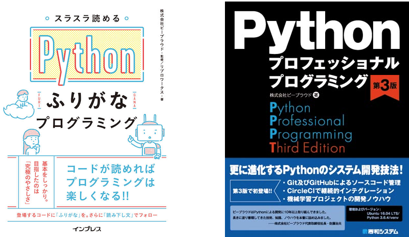

## Pythonってどんな言語?

### 導入事例や気になるトレンドについて 

2018 Jun 26 / テクトモ #1

Takanori Suzuki

---?include=20180626techtomo/md/about.md

---

## 最初に質問

+++

### Python知っている人?

+++

### Python書いたことある人?

+++

### 他のプログラミング言語は書いたことある人?

---

## Pythonの歴史

+++

### Python 0.9.0

* 1991年に公開
* netnewsにソースコードが公開された
* list, dict, str

+++

### Python 1系

* 1994年1月に1.0リリース
* lambda, map, filter, reduce
* Python 1.6が2000年にリリース

+++

### Python 2系

* 2000年10月に2.0がリリース
* 2.7.15が最新(2018年5月5日)
* 2020年1月1日でサポート終了
  * [PEP 404 - Python 2.8 Un-release Schedule](https://www.python.org/dev/peps/pep-0404/)

+++

### Python 3系

* 2008年12月に3.0がリリース
* Python 2系との後方互換性を一部削除
* 3.6.5が最新(2018年5月28日)
* 3.7.0がもうすぐ(2018年6月27日)リリース予定

---

## Pythonの特徴

+++

### 設計思想

* シンプルで読みやすいコードが書けること
* 同じ動作をするプログラムは似たようなコードに

+++

### インデント

* ブロック構造をインデントで表現

```python
for i in range(10):
    if i % 5 == 0:
        print('ham')
    elif i % 3 == 0:
        print('eggs')
    else:
        print('spam')
```

+++

### PEP: Python Enhanthment Proposal

* Python拡張の提案
* 拡張のアイデアをドキュメント化
  * レビューして採用/不採用を判断
  * [PEP 1 - PEP Purpose and Guidelines](http://sphinx-users.jp/articles/pep1.html)
  * [PEP 1 - PEP Purpose and Guidelines(日本語訳)](http://sphinx-users.jp/articles/pep1.html)
* PEPの一覧ページもPEP
  * [PEP 0 – Index of Python Enhancement Proposals(PEPs)](https://www.python.org/dev/peps/)

+++

### PEP8

* Pythonのコーディング規約
  * [PEP8 - Style Guide for Python Code](https://www.python.org/dev/peps/pep-0008/)
  * [pep8-ja](http://pep8-ja.readthdocs.io/)
* インデントはスペース4つ

+++

### PEP8

* Yes

```python
import os
import sys

spam(1)
```

* No

```python
import sys, os

spam (1)
```

+++

### The Zen of Python

* [PEP 20 - The Zen of Python](https://www.python.org/dev/peps/pep-0020/)

```python
>>> import this
The Zen of Python, by Tim Peters

Beautiful is better than ugly.
Explicit is better than implicit.
Simple is better than complex.
Complex is better than complicated.
Flat is better than nested.
Sparse is better than dense.
Readability counts.
Special cases aren't special enough to break the rules.
Although practicality beats purity.
Errors should never pass silently.
Unless explicitly silenced.
In the face of ambiguity, refuse the temptation to guess.
There should be one-- and preferably only one --obvious way to do it.
Although that way may not be obvious at first unless you're Dutch.
Now is better than never.
Although never is often better than *right* now.
If the implementation is hard to explain, it's a bad idea.
If the implementation is easy to explain, it may be a good idea.
Namespaces are one honking great idea -- let's do more of those!
```

---

## 導入事例

---

## Pythonの現在のトレンド

Note:

---

## Pythonの今後の展望

---

## これからPythonを学ぶには

---

## One more thing...

+++

### 懇親会で書籍プレゼント

* スラスラ読める Pythonふりがなプログラミング x 3
* Pythonプロフェッショナルプログラミング 第3版 x 1



Note:
* Pythonふりがなプログラミングの著者の一人の大津さんが見えてます

---

## ありがとうございました

---

## Question?


